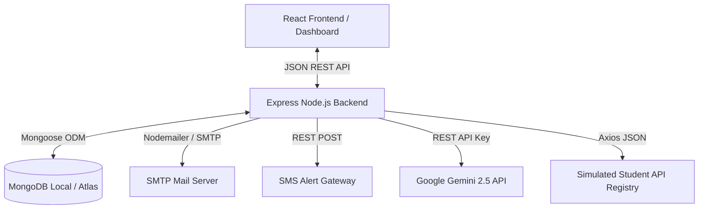

# Campus Attendance & Latecomers Management System

A production-grade, sanitized **MERN (MongoDB, Express, React, Node.js)** full-stack application designed to track and manage student and faculty attendance at campus entry gates and academic building checkpoints. 

This repository represents the **sanitized public portfolio version** of the system, tailored with demo credentials, simulated lookup endpoints, and a mock seeder script. It features an advanced **AI-powered Natural Language Query Module** integrated with the **Gemini API** for secure, intuitive reporting.

---

## 🏗️ System Architecture



### Key Components
1. **React Frontend**: A premium responsive dashboard based on Reactstrap with live data charts (Chart.js), barcode scanning modal interfaces, and an AI search console.
2. **Express Backend**: Secure REST API handling gate scans, building scans, visitor logs, exam schedules, and user roles.
3. **Cron Job Engine**: Autonomous Node-Cron tasks compiling monthly latecomer reports into formatted Excel spreadsheets and emailing them via SMTP.
4. **AI Query Assistant**: Translates plain-English inquiries into secure Mongoose filters, providing rate-limited, validated data views to HODs and Admins.

---

## ⚡ Key Features

* **Checkpoints Tracking**: Barcode scanning interfaces for Gate Entry and Building Entry (using local mock validation endpoints).
* **Automatic Warn Messages**: Real-time SMS warning system sending alerts to parents when students exceed latecomer thresholds.
* **Monthly Cron Reports**: Scheduled tasks calculating late statistics and emailing formatted Excel sheets to relevant campus HODs.
* **Faculty Check-Ins**: Dedicated tracking dashboard for staff arrivals.
* **Security Sanitized**: Removed all production environment credentials, VISPL SMS gateway keys, personal SMTP passwords, and confidential student datasets.
* **High-Fidelity Database Seeder**: Generates 30 days of realistic history (~1,100 gate entries, ~1,000 building entries, faculty checks, exams, and visitors) with different attendance profiles (e.g. chronic latecomers, occasional latecomers, on-time).

---

## 🗄️ Database Schemas

The database structure consists of **9 Mongoose Schemas** mapped to MongoDB collections:

| Collection | Schema Name | Description | Key Fields |
|:---|:---|:---|:---|
| `loginschemas` | `LoginSchema` | User credentials and authorization roles. | `username`, `password`, `role`, `building` |
| `studentmasters` | `studentMaster` | Student registry containing master info. | `studentName`, `studentRoll` (unique), `college`, `branch`, `suspended` |
| `studentschemas` | `studentsSchema` | Gate arrival attendance scans. | `studentRoll`, `date`, `inTime`, `outTime` |
| `studentbuildingschemas` | `studentBuildingSchema` | Building scan attendance logs. | `studentRoll`, `building`, `date`, `inTime` |
| `facultydatabases` | `facultyDataBase` | Master faculty registry database. | `facultyName`, `facultyId`, `facultyCollege`, `facultyBranch` |
| `facultyschemas` | `facultySchema` | Faculty check-in logs. | `facultyId`, `date`, `inTime` |
| `visitordatas` | `visitordata` | Visitor gate pass passes register. | `visitorName`, `passNumber`, `personToMeet`, `inDate`, `inTime` |
| `examschedules` | `examSchedule` | Internal exam timelines for daily scheduling. | `examName`, `collegeCode`, `program`, `startDate`, `endDate` |
| `errorschemas` | `errorSchema` | Log of card scanner failures. | `studentRoll`, `date` |

---

## 🛠️ Project Setup & Installation

### Prerequisites
* **Node.js** (v18+)
* **MongoDB** (Local instance running on `27017` or Atlas Connection String)
* **Gemini API Key** (Required for the AI module)

### 1. Environment Configurations
Configure the local `.env` file inside both project folders:

#### Backend Config (`Latecomers_Backend/.env`)
```env
PORT=5001
DBURL=mongodb://127.0.0.1:27017/latecomers_demo
GEMINI_API_KEY=your_gemini_api_key_here

# SMS Gateway Config
DAILYMSGURL=https://api.demo.edu/sms/send
SMS_USER=your_sms_gateway_username
SMS_PASS=your_sms_gateway_password

# Mail SMTP Config
MAIL_HOST=smtp.demo.edu
MAIL_PORT=587
MAIL_USER=your_mail_user@demo.edu
MAIL_PASS=your_mail_password
MAIL_FROM="Monthly Report" <your_mail_from@demo.edu>
MAIL_RECIPIENTS=recipient1@demo.edu
```

#### Frontend Config (`Latecomers_Frontend/.env`)
```env
PORT=8080
REACT_APP_DEFAULTAUTH=fake
REACT_APP_API=http://localhost:5001/api
```

### 2. Dependency Installation & Seeding
Install backend and frontend dependencies, and seed the demo database with mock data.

```bash
# Setup Backend
cd Latecomers_Backend
npm install
node seed.js     # Seeds local database with 30-day realistic log history

# Setup Frontend
cd ../Latecomers_Frontend
npm install --legacy-peer-deps
```

### 3. Running the Project
```bash
# Start Backend (runs on http://localhost:5001)
cd Latecomers_Backend
npm start

# Start Frontend (runs on http://localhost:8080)
cd ../Latecomers_Frontend
npm start
```

Use the following credentials to log in:
* **Admin Role**: `admin@demo.edu` / `demo1234`
* **HOD Role**: `hod@demo.edu` / `demo1234`

---

## 🤖 AI Natural Language Query Module

The system contains an **AI Search Console** restricted to Admins and HODs. Users can search attendance logs using conversational English:

* *"Show BBA students who came late this week"*
* *"Who entered Ratan Tata Bhavan building late yesterday?"*
* *"Find student Aarav Sharma's gate entries"*

### Security Workflow
1. **Request Verification**: The backend restricts incoming requests to logged-in sessions matching `admin` or `hod` roles.
2. **Strict Metadata Constraints**: The prompt injected into Gemini limits the response strictly to a predefined JSON schema containing allowed model fields (`studentRoll`, `studentName`, `collegeCode`, `date`, `inTime`, `building`) and operators (`equals`, `contains`, `gte`, `lte`, `between`).
3. **Mongoose Sanitization**: The server parses the returned JSON filters, escapes regex inputs to prevent injection attacks, wraps date parameters in `Date` objects, limits the output length to **100 records**, and executes the query cleanly.
4. **Memory Rate Limiter**: Rate-limits AI queries to a maximum of **10 requests per minute** per user to prevent API abuse.

---

## 🚀 One-Click Cloud Deployment (Render Blueprint)

This project is pre-configured with a Render Blueprint (`render.yaml`) that lets you deploy both the React Frontend and the Express Backend simultaneously.

[](https://render.com/deploy?repo=https://github.com/KvPradeepthi/LateComers)

### Deployment Steps:
1. Click the **Deploy to Render** button above.
2. In the Render configuration dashboard, fill in the required environment variables:
   - `DBURL`: Your MongoDB Atlas Connection String.
   - `GEMINI_API_KEY`: Your Google Gemini API Key.
   - `MAIL_USER` / `MAIL_PASS`: SMTP email details for reports (optional).
3. Click **Apply**.
4. Render will automatically spin up your Node.js backend web service and build/deploy your React frontend as a static site, linking them together automatically.

---

## 📝 Contributions & Credits

* **Author**: Built by Veera Pradeepthi
* **Branding**: Cleaned portfolio-safe Campus Attendance Management System.
* **Disclaimer**: This is a sanitized portfolio simulation based on a real-world system deployed for collegiate attendance administration. All personnel, roles, and contacts shown in the demo seeder are mock placeholders.
