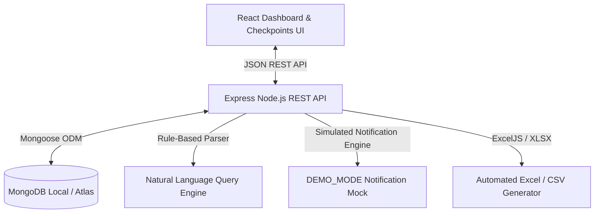

# Campus Attendance & Visitor Management System (LateComers)

A full-stack **MERN (MongoDB, Express, React, Node.js)** web application designed for comprehensive campus attendance tracking, digital gate checkpoints, building-level verification, and visitor pass administration.

> **Portfolio Demo Notice:**  
> This repository contains a **sanitized public portfolio demonstration** of a real-world campus attendance system deployed across collegiate checkpoints. All institutional infrastructure addresses, private keys, and student records have been replaced with **fictional datasets and demo-safe integrations**.

---

## 🎯 Live Recruiter Demo

* **Public Web App**: [https://latecomers-frontend.onrender.com](https://latecomers-frontend.onrender.com)
* **Demo Account**: `demo@demo.edu`
* **Password**: `demo1234`
* **One-Click Access**: The login screen features an **`[ Enter Demo ]`** button for immediate, single-click access with pre-filled credentials.

---

## 🏗️ System Architecture


```mermaid
graph TD
    Client[React Dashboard & Checkpoints UI] <-->|JSON REST API| Server[Express Node.js REST API]
    Server <-->|Mongoose ODM| DB[(MongoDB Local / Atlas)]
    Server -->|Rule-Based Parser| NLPEngine[Natural Language Query Engine]
    Server -->|Simulated Notification Engine| DemoAlerts[DEMO_MODE Notification Mock]
    Server -->|ExcelJS / XLSX| ReportEngine[Automated Excel / CSV Generator]
```

### Key Technical Pillars
1. **React Frontend**: Built on React 18 and Reactstrap with responsive dashboards, interactive Chart.js analytics, modal-based barcode scanning interfaces, and one-click demo access.
2. **Express Backend**: Secure REST API handling attendance logs, building scans, visitor registers, exam schedules, and master student records.
3. **Natural Language Query Assistant**: A deterministic, rule-based NLP assistant that parses conversational English queries into secure MongoDB filters with transparent query breakdowns.
4. **Automated Reporting Engine**: Generates daily, weekly, and monthly attendance and latecomer reports formatted into downloadable Excel (.xlsx) spreadsheets.
5. **Deterministic Seeding Engine**: Populates 30 days of consistent attendance history (~1,100 gate logs, ~1,000 building logs, visitors, faculty check-ins, and active exam schedules), with guaranteed rich entries for **Today**.

---

## ⚡ Core Features & Live-System Parity

* **Digital Checkpoint Tracking**: Gate Entry and Academic Building check-in interfaces with automated latecomer status determination (arrivals after 09:30 AM).
* **Visitor Pass Management**: Comprehensive visitor registration logging visitor name, mobile, vehicle number, purpose of visit, person to meet, check-in, and check-out tracking.
* **Student & Faculty Analysis**: Deep-dive analytics providing branch-wise breakdowns, college comparisons, gender ratios, and chronic latecomer frequency tracking.
* **Automated Reports**: Downloadable Excel and CSV exports for daily arrivals, weekly trends, and month-end summaries.
* **Student Suspension Enforcement**: Centralized suspension register that prevents unauthorized campus gate entry for flagged students.
* **Exam Schedule Monitoring**: Timelines for internal and semester examinations.
* **Query Assistant**: Plain-English attendance query tool with transparent filter interpretation (Target, Branch, Date Range, Condition, and Records Found).
* **Demo-Safe Notifications**: Configured with `DEMO_MODE=true` to simulate parent SMS alerts and admin email reports safely without external delivery dependencies.

---

## 🗄️ Database Schema Overview

The application utilizes **9 Mongoose Schemas** mapped to MongoDB collections:

| Collection | Schema Name | Description | Key Fields |
|:---|:---|:---|:---|
| `loginschemas` | `LoginSchema` | Demo credentials and authorization roles | `username`, `password`, `role`, `building` |
| `studentmasters` | `studentMaster` | Student master registry | `studentName`, `studentRoll` (unique), `college`, `branch`, `suspended` |
| `studentschemas` | `studentsSchema` | Gate arrival attendance scans | `studentRoll`, `date`, `inTime`, `outTime` |
| `studentbuildingschemas` | `studentBuildingSchema` | Academic building check-ins | `studentRoll`, `building`, `date`, `inTime` |
| `facultydatabases` | `facultyDataBase` | Master faculty registry | `facultyName`, `facultyId`, `facultyCollege`, `facultyBranch` |
| `facultyschemas` | `facultySchema` | Faculty arrival logs | `facultyId`, `date`, `inTime` |
| `visitordatas` | `visitordata` | Campus visitor passes | `visitorName`, `vehicleNumber`, `personToMeet`, `purpose`, `status` |
| `examschedules` | `examSchedule` | Semester examination schedules | `examName`, `collegeCode`, `program`, `startDate`, `endDate` |
| `errorschemas` | `errorSchema` | Scanner diagnostic logs | `studentRoll`, `date` |

---

## 🛠️ Local Installation & Setup

### Prerequisites
* **Node.js** (v18 or higher)
* **MongoDB** (Local instance on `mongodb://127.0.0.1:27017` or MongoDB Atlas URI)

### 1. Backend Setup
```bash
cd Latecomers_Backend

# Install dependencies
npm install

# Seed the database with 30-day realistic history + Today's data
npm run seed

# Start the backend server (runs on port 5001)
npm start
```

### 2. Frontend Setup
```bash
cd Latecomers_Frontend

# Install dependencies
npm install --legacy-peer-deps

# Start the React development server (runs on port 8080)
npm start
```

### 3. Log In
Open your browser at `http://localhost:8080` and click **`[ Enter Demo ]`** or log in manually with:
* **Email:** `demo@demo.edu`
* **Password:** `demo1234`

---

## 🔍 Natural Language Query Assistant

The system includes a conversational query assistant that translates English attendance queries into structured MongoDB queries:

* *"Show CSE students who arrived late this week"*
* *"Who entered Ratan Tata Bhavan yesterday?"*
* *"Show latecomers this month"*
* *"Find Aarav Sharma's attendance"*
* *"Show BBA students who arrived late"*

### Transparent Interpretation
When a query executes, the assistant presents a clear **Query Interpretation** breakdown displaying:
* **Target Log:** Gate Attendance vs. Building Scan
* **Branch Filter:** e.g., CSE, BBA, All
* **Date Range:** Today, Yesterday, Last 7 Days, Last 30 Days
* **Condition:** Late Entry (Arrived after 09:30 AM), Student Roll, etc.
* **Total Records Found**

---

## 🚀 Cloud Deployment (Render Blueprint)

This project includes a validated `render.yaml` blueprint for one-click deployment:

1. Connect this repository to **Render Blueprints**.
2. Set the `DBURL` environment variable for `latecomers-backend` to your MongoDB Atlas connection string.
3. Render automatically builds and hosts the Node.js backend and React static frontend.
4. Run `npm run seed` in your Render Shell once to populate your cloud database.

---

## 📝 Credits & Attribution

* **Author:** Built by Veera Pradeepthi
* **License:** ISC
* **Environment:** Sanitized Portfolio Demo Version
